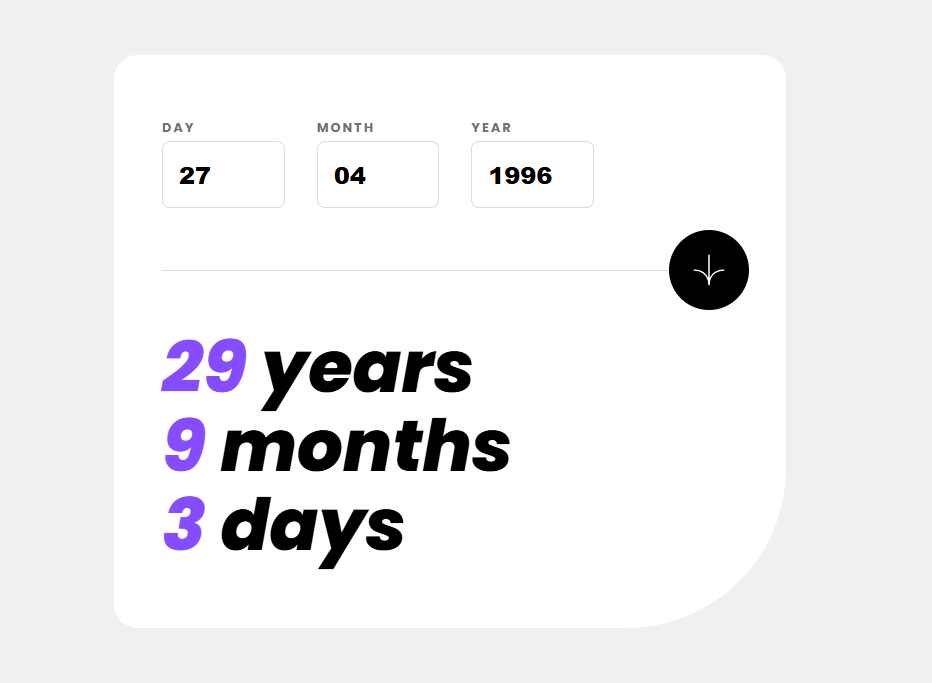

# Age Calculator App

A solution to the Frontend Mentor **Age Calculator App** challenge, built with a mobile-first approach using React and SCSS.

## Overview

Users can enter their date of birth and instantly see their age calculated in years, months, and days.  
The app includes full form validation and smooth number animations for a polished user experience.

## Features

- Mobile-first responsive layout
- Controlled React form inputs
- Custom validation for dates and edge cases
- Accessible error messages and keyboard support
- Animated count-up results
- Clean SCSS architecture with reusable mixins

## Built with

- React
- Vite
- SCSS (BEM-style naming)
- JavaScript Date API
- requestAnimationFrame (for animations)

## What I learned

- Structuring React components and hooks cleanly
- Writing layered form validation logic
- Handling JavaScript date edge cases
- Implementing accessible, user-friendly forms
- Creating reusable custom hooks for UI animation

## Screenshots

## Live site

[View Live Site](https://krisp-dev.github.io/Frontend-Mentor-Challenges/Junior/age-calculator-app/site/)

## Frontend Mentor

Challenge by [Frontend Mentor](https://www.frontendmentor.io).  
[Age Calculator App](https://www.frontendmentor.io/challenges/age-calculator-app-dF9DFFpj-Q).
